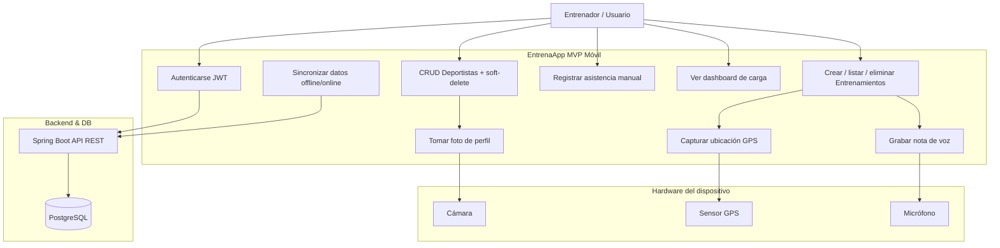
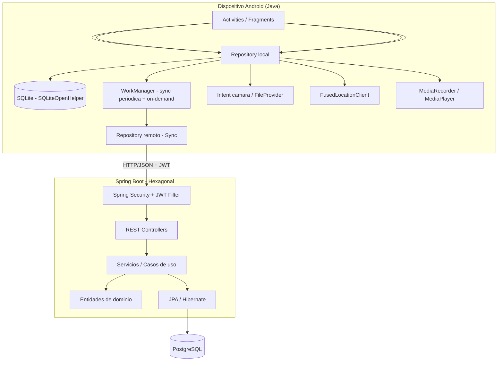
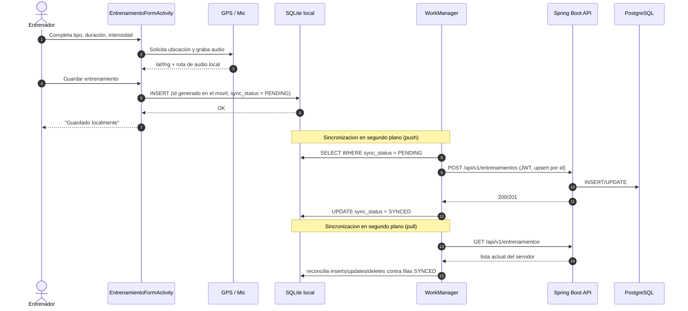
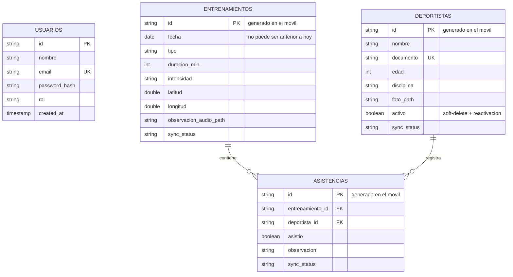

# EntrenaApp — MVP

Aplicación para entrenadores deportivos: registro de deportistas, entrenamientos (con GPS y nota de voz), asistencia y reportes de carga. Demostración **100% autónoma en un solo dispositivo móvil** (Android), con sincronización bidireccional a un backend central cuando hay conectividad.

**Actividad:** Actividad III — Arquitectura y desarrollo móvil
**Stack:** Android Studio (Java, SQLite nativo) · Spring Boot 4.1.1 (arquitectura hexagonal, Java 21) + Spring Security/JWT · PostgreSQL 17 · Docker

## Módulos del repositorio

| Carpeta | Contenido | Estado |
|---|---|---|
| [`entrenaapp-api/`](entrenaapp-api) | Backend REST (Spring Boot) | **Completo.** CRUD, auth JWT, reportes/dashboard. |
| [`entrenaapp-db/`](entrenaapp-db) | PostgreSQL vía Docker Compose + `init.sql` | Completo. |
| [`entrenaapp-mobile/`](entrenaapp-mobile) | App Android (Java) | **Completo (MVP).** Login, CRUD offline-first, GPS+audio, sincronización bidireccional, dashboard. Ver [`ARCHITECTURE.md`](entrenaapp-mobile/ARCHITECTURE.md) para el detalle de paquetes. |

## Decisiones de alcance del MVP

Estas decisiones fijan el alcance real frente al diagrama de arquitectura ideal:

1. **Autenticación:** JWT real en la API (`AuthController` + Spring Security). La app mobile hace `POST /api/v1/auth/login`, guarda el token cifrado (`EncryptedSharedPreferences`) y lo reutiliza como sesión offline — no se guarda copia de la contraseña en el dispositivo.
2. **Multimedia (foto de perfil, nota de voz):** se guardan **solo localmente** en el dispositivo; en SQLite y en PostgreSQL solo se persiste la *ruta* (`foto_path`, `observacion_audio_path`), no el binario. No hay subida de archivos a la API — coherente con "demo autónoma en 1 dispositivo".
3. **IDs de sincronización:** el móvil genera el UUID de cada registro (deportista/entrenamiento/asistencia) y la API lo acepta y reutiliza (`POST` hace upsert por `id`). No existe tabla de mapeo entre IDs locales y remotos.
4. **Eliminación de Deportista:** soft-delete (`activo`), no borrado físico, para no perder historial de asistencia. Si se vuelve a crear un deportista con el mismo documento de uno inactivo, se reactiva en vez de duplicar. `Entrenamiento` no tiene soft-delete (borrado físico simple).
5. **Sincronización:** bidireccional. *Push* automático (WorkManager) de cada escritura local pendiente hacia la API. *Pull* automático que reconcilia deportistas/entrenamientos/asistencias contra lo que hay en el servidor (inserta lo nuevo, actualiza lo cambiado, refleja localmente lo borrado/desactivado remoto) — necesario porque el servidor es la fuente de verdad y puede cambiar fuera de la app (ej. un delete directo en la BD o desde otro dispositivo).
6. **Reportes/Dashboard:** existen ambas variantes. La API expone `GET /api/v1/dashboard/stats` y `GET /api/v1/reportes/carga` como agregaciones simples. El Home de la app mobile, sin embargo, calcula sus propias estadísticas **desde SQLite local** (no llama a estos endpoints), para mantener el dashboard funcionando sin conexión igual que el resto de la app.
7. **QR:** reemplazado por foto de perfil vía cámara en el MVP. Lectura de QR queda registrada como Fase II (post-MVP).

## Arquitectura

### Casos de uso



### Componentes



### Flujo: registrar un entrenamiento (offline-first, con pull-sync)



### Modelo de datos



`sync_status` (`PENDING` / `SYNCED`) solo existe en SQLite (mobile); en PostgreSQL cada fila sincronizada ya está confirmada, así que la API no necesita esa columna. `activo` sí existe en ambos lados (Deportista), porque el soft-delete es una regla de negocio, no un detalle de sincronización.

### Mapeo Pantalla → Android → Sensor → Endpoint → Datos

| Pantalla | Componente Android | Sensor | Endpoint API | Datos |
|---|---|---|---|---|
| Login | `LoginActivity` | — | `POST /api/v1/auth/login` | JWT en `EncryptedSharedPreferences` (no se guarda password) |
| Home / Dashboard | `HomeFragment` | — | *(ninguno — calculado local)* | Agregado sobre SQLite (deportistas/entrenamientos/asistencias) |
| Deportistas | `DeportistasFragment` / `DeportistaFormActivity` / `DeportistaDetailActivity` | Cámara | `GET/POST/PUT/DELETE /api/v1/deportistas` | SQLite + PostgreSQL (solo `foto_path`, soft-delete) |
| Entrenamientos | `EntrenamientosFragment` / `EntrenamientoFormActivity` / `EntrenamientoDetailActivity` | GPS + Mic | `GET/POST /api/v1/entrenamientos` | SQLite + PostgreSQL |
| Asistencia | `AsistenciaFragment` | — | `POST /api/v1/asistencias`, `GET /api/v1/asistencias/entrenamiento/{id}` | SQLite + PostgreSQL |
| Ajustes | `SettingsFragment` | — | — | Cerrar sesión (borra el JWT local) |
| *(disponible, no consumido por mobile)* | — | — | `GET /api/v1/dashboard/stats`, `GET /api/v1/reportes/carga` | Calculado en la API sobre PostgreSQL |

## Cómo levantar el entorno (dev)

### Opción A — todo en Docker (recomendado, no depende del IDE)

Desde la raíz del repo:

```bash
docker compose up -d --build
```

Levanta Postgres (`entrenaapp_db`) y la API (`entrenaapp_api`, puerto 8080) en contenedores, esperando a que Postgres esté healthy antes de arrancar la API. Para reconstruir tras cambios en `entrenaapp-api/`: `docker compose up -d --build api`. Logs: `docker compose logs -f api`. Apagar: `docker compose down` (agrega `-v` solo si quieres borrar también los datos de Postgres).

### Opción B — API desde el IDE (para debug)

```bash
# 1. Solo la base de datos
cd entrenaapp-db
docker compose up -d

# 2. API (desde entrenaapp-api/, Windows) — requiere JDK 21
mvnw.cmd spring-boot:run
```

### Mobile

Abrir `entrenaapp-mobile/` en Android Studio y ejecutar en emulador/dispositivo, o por línea de comandos:

```bash
cd entrenaapp-mobile
gradlew.bat :app:installDebug
```

La URL base de la API se lee de `entrenaapp-mobile/local.properties` (gitignored, no se commitea) como `API_BASE_URL=...`:

- **Emulador:** no hace falta configurarlo, cae por defecto a `http://10.0.2.2:8080/` (la API corriendo en `localhost:8080` del host).
- **Dispositivo físico:** necesita una URL alcanzable desde el teléfono. Para pruebas rápidas sin desplegar, se puede exponer la API local con [ngrok](https://ngrok.com/) (`ngrok http 8080`) y usar esa URL HTTPS en `local.properties`.

## Fase II (post-MVP, fuera de alcance actual)

- Registro/lectura por código QR en vez de/junto a la foto de perfil.
- Subida de foto/audio como binario al backend (multipart) en lugar de solo la ruta local.
- Roles y permisos por `Usuario.rol` (hoy el campo existe pero no se usa para autorización).
- Consumo real de `GET /api/v1/dashboard/stats` / `GET /api/v1/reportes/carga` desde mobile (ej. para un modo "resumen del equipo" agregando varios dispositivos), o su eliminación si nunca llegan a usarse.
- Pantalla de perfil individual del deportista con métricas de rendimiento (1RM, RPE, volumen) — evaluada durante Reportes y descartada para este MVP por no tener esas métricas modeladas todavía.
