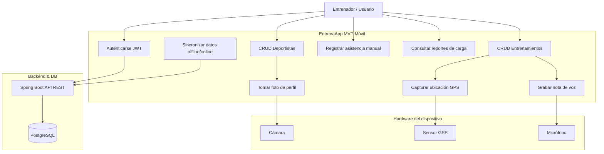
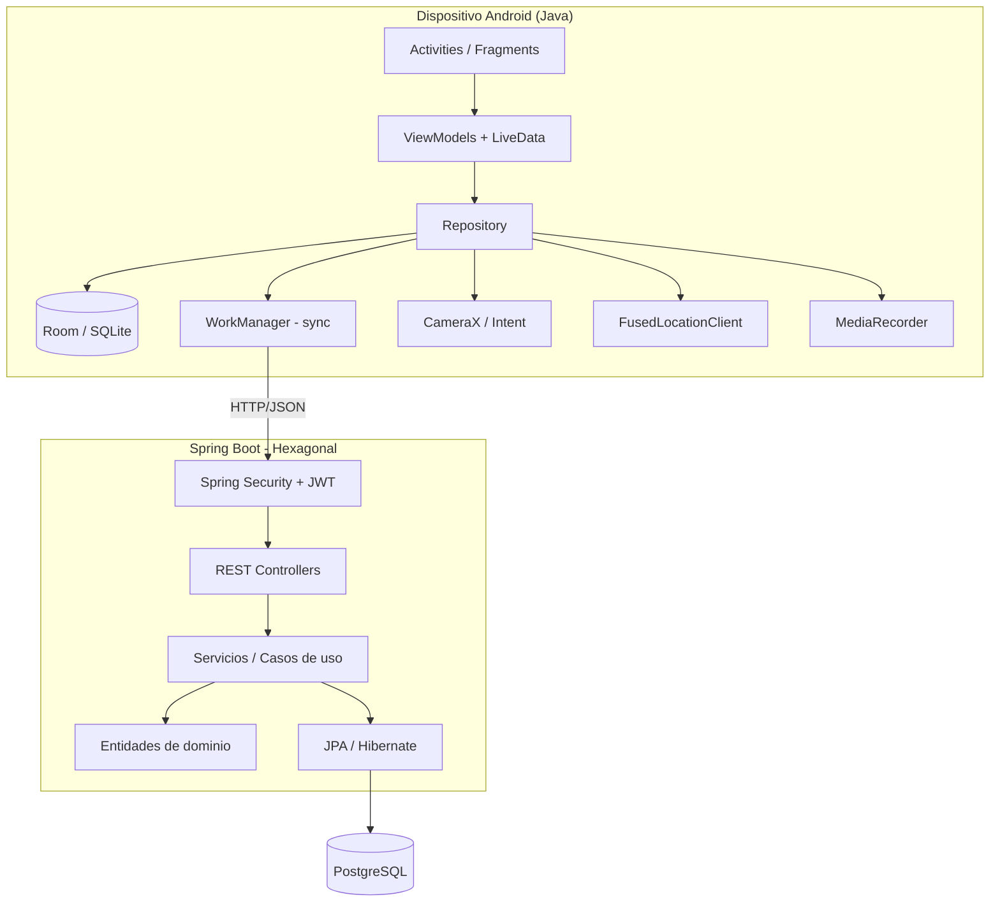
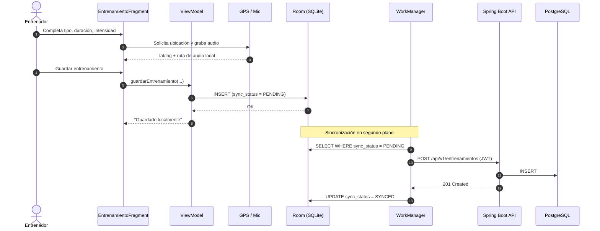
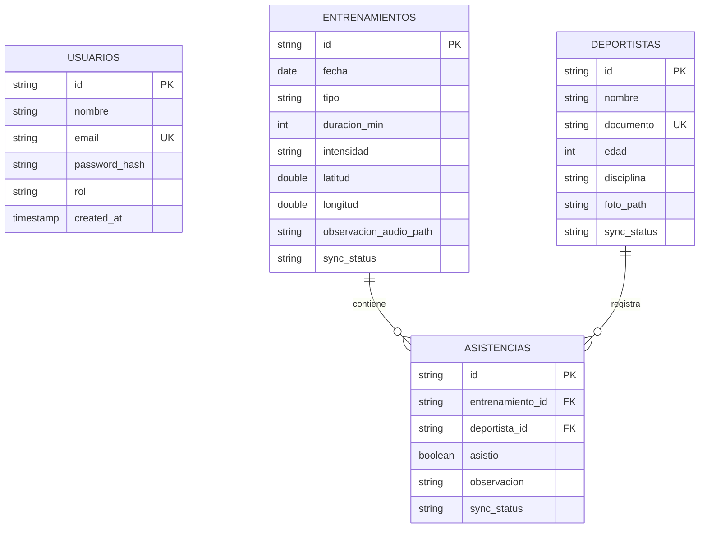

# EntrenaApp — MVP

Aplicación para entrenadores deportivos: registro de deportistas, entrenamientos (con GPS y nota de voz), asistencia y reportes de carga. Demostración **100% autónoma en un solo dispositivo móvil** (Android), con sincronización a un backend central cuando hay conectividad.

**Actividad:** Actividad III — Arquitectura y desarrollo móvil
**Stack:** Android Studio (Java) + Room (SQLite) · Spring Boot 4.1.1 (arquitectura hexagonal, Java 21) · PostgreSQL 17

## Módulos del repositorio

| Carpeta | Contenido | Estado |
|---|---|---|
| [`entrenaapp-api/`](entrenaapp-api) | Backend REST (Spring Boot) | CRUD de Deportista/Entrenamiento/Asistencia listo. Auth JWT y reportes pendientes (ver Plan). |
| [`entrenaapp-db/`](entrenaapp-db) | PostgreSQL vía Docker Compose + `init.sql` | Listo. |
| [`entrenaapp-mobile/`](entrenaapp-mobile) | App Android (Java) | Scaffold inicial de Android Studio, sin funcionalidad todavía. |

## Decisiones de alcance del MVP

Estas decisiones fijan el alcance real frente al diagrama de arquitectura ideal:

1. **Autenticación:** se implementa JWT real en la API (`AuthController` + Spring Security), no un login simulado en el dispositivo. La app mobile hace `POST /api/v1/auth/login` y guarda el token para las siguientes llamadas.
2. **Multimedia (foto de perfil, nota de voz):** se guardan **solo localmente** en el dispositivo (almacenamiento interno); en Room y en PostgreSQL solo se persiste la *ruta* (`foto_path`, `observacion_audio_path`), no el binario. No hay subida de archivos a la API en este MVP — coherente con "demo autónoma en 1 dispositivo".
3. **Reportes/Dashboard:** `GET /api/v1/dashboard/stats` y `GET /api/v1/reportes/carga` se construyen en la API ahora, como agregaciones simples sobre `entrenamientos`/`asistencias` (conteos, promedios de duración/intensidad). No requieren tablas nuevas.
4. **QR:** reemplazado por foto de perfil vía cámara en el MVP. Lectura de QR queda registrada como Fase II (post-MVP).

## Arquitectura

### Casos de uso



### Componentes



### Flujo: registrar un entrenamiento (offline-first)



### Modelo de datos



`sync_status` (`PENDING` / `SYNCED`) solo existe en Room (mobile); en PostgreSQL cada fila sincronizada ya está confirmada, así que la API no necesita esa columna.

### Mapeo Pantalla → Android → Sensor → Endpoint → Datos

| Pantalla | Componente Android | Sensor | Endpoint API | Datos |
|---|---|---|---|---|
| Login | `LoginActivity` / `AuthViewModel` | — | `POST /api/v1/auth/login` | Token JWT (no persistido en DB local más allá de sesión) |
| Home / Dashboard | `MainActivity` / `DashboardFragment` | — | `GET /api/v1/dashboard/stats` | Caché en Room |
| Deportistas | `DeportistaListFragment` | — | `GET /api/v1/deportistas` | Room (`deportistas`) |
| Crear deportista | `DeportistaFormFragment` | Cámara | `POST /api/v1/deportistas` | Room + PostgreSQL (solo `foto_path`) |
| Entrenamientos | `EntrenamientoFragment` | GPS + Mic | `POST /api/v1/entrenamientos` | Room + PostgreSQL |
| Asistencia | `AsistenciaManualFragment` | — | `POST /api/v1/asistencias` | Room + PostgreSQL |
| Reportes | `ReportesFragment` | — | `GET /api/v1/reportes/carga` | Calculado en API |

## Plan de trabajo

**Fase 0 — hecho.** CRUD de `Deportista`, `Entrenamiento`, `Asistencia` en la API; esquema base en `init.sql`; `SecurityConfig` abierto.

**Fase 1 — Backend: cerrar el contrato antes de tocar mobile.**
1. `AuthController` (`POST /api/v1/auth/login`, `POST /api/v1/auth/register` si aplica) + filtro JWT + `Spring Security` protegiendo `/api/v1/**` salvo `/auth/**`.
2. `GET /api/v1/dashboard/stats` y `GET /api/v1/reportes/carga` (agregaciones sobre `entrenamientos`/`asistencias`).
3. Confirmar que `DeportistaRequest`/`EntrenamientoRequest` ya soportan `foto_path` / `observacion_audio_path` (son solo strings, no binarios).

**Fase 2 — Mobile: base del proyecto.**
1. Dependencias Gradle: Room, Retrofit + OkHttp (con interceptor para el JWT), WorkManager, CameraX, `play-services-location`, Navigation Component.
2. Capa de datos: entidades Room (espejo del ERD, + `sync_status`), DAOs, `AppDatabase`.
3. Capa de red: interfaces Retrofit que reflejan los endpoints de la tabla de mapeo, `ApiClient` con base URL configurable (emulador → `10.0.2.2`).
4. `Repository` por entidad que decide Room vs API y arma el patrón offline-first.

**Fase 3 — Pantallas, en orden de dependencia.**
1. Login (JWT) → guarda token en `EncryptedSharedPreferences`.
2. Deportistas: listar/crear/editar + captura de foto (CameraX o `Intent` a cámara del sistema).
3. Entrenamientos: formulario + captura GPS (`FusedLocationClient`) + grabación de audio (`MediaRecorder`).
4. Asistencia manual (por entrenamiento, marcar deportistas presentes/ausentes).
5. Reportes: consumo de `GET /api/v1/reportes/carga`.

**Fase 4 — Sincronización.**
1. `WorkManager` periódico/on-connectivity que empuja filas `PENDING` a la API y marca `SYNCED`.
2. Manejo de conflictos simple (último en escribir gana) — suficiente para el alcance del MVP.

**Fase 5 — Cierre para la demo.**
1. Datos semilla (`init.sql` o seed en primer arranque) para que el demo no dependa de conectividad.
2. Prueba end-to-end en un solo dispositivo: login → crear deportista con foto → crear entrenamiento con GPS+audio → asistencia → reporte → sync.
3. Documentar en este README cómo levantar los 3 módulos para la sustentación.

## Cómo levantar el entorno (dev)

### Opción A — todo en Docker (recomendado, no depende del IDE)

Desde la raíz del repo:

```bash
docker compose up -d --build
```

Levanta Postgres (`entrenaapp_db`) y la API (`entrenaapp_api`, puerto 8080) en contenedores, esperando a que Postgres esté healthy antes de arrancar la API. Para reconstruir tras cambios en `entrenaapp-api/`: `docker compose up -d --build api`. Logs: `docker compose logs -f api`. Apagar: `docker compose down` (agrega `-v` solo si quieres borrar también los datos de Postgres).

### Opción B — API desde el IDE (para debug)

```bash
# 1. Solo la base de datos
cd entrenaapp-db
docker compose up -d

# 2. API (desde entrenaapp-api/, Windows)
mvnw.cmd spring-boot:run
```

### Mobile

Abrir `entrenaapp-mobile/` en Android Studio y ejecutar en emulador/dispositivo. Base URL del emulador hacia la API (en cualquiera de las dos opciones, corre en `localhost:8080` del host): `http://10.0.2.2:8080`.

## Fase II (post-MVP, fuera de alcance actual)

- Registro/lectura por código QR en vez de/junto a la foto de perfil.
- Subida de foto/audio como binario al backend (multipart) en lugar de solo la ruta local.
- Roles y permisos por `Usuario.rol` (hoy el campo existe pero no se usa para autorización).
